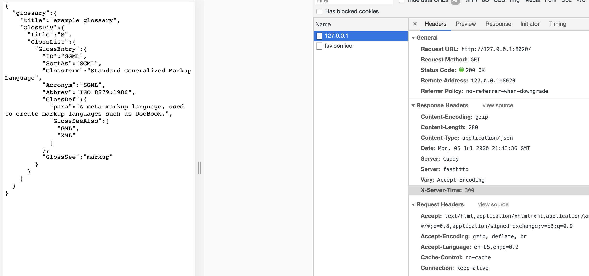

# dummy-mock
Referenced and Thanks to : https://medium.com/@aimvec/high-performance-mocking-for-load-testing-bd6d69610cc9

### preparation:
install docker  
install caddy server  

### How to: 
`cd path/to/target/dir`  
`docker build . -t mymock`  
`docker images`  
`docker run -d --rm -p 9091:80 mymock`  
`docker ps -a | grep mymock`  

`caddy start`  

P.S. Removed unused docker images
`docker rmi -f $(docker images -f "dangling=true" -q)`
